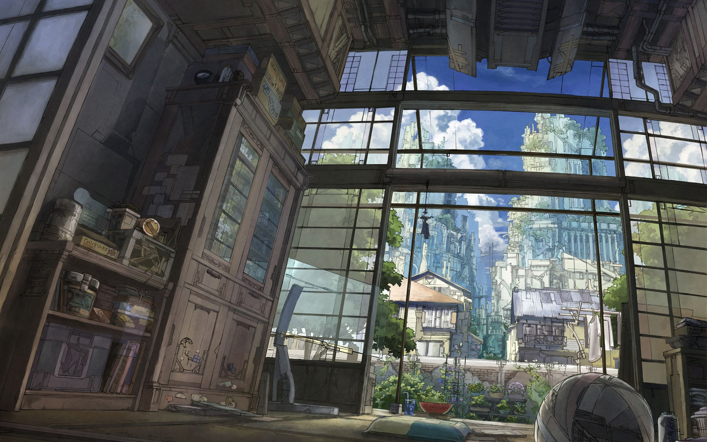
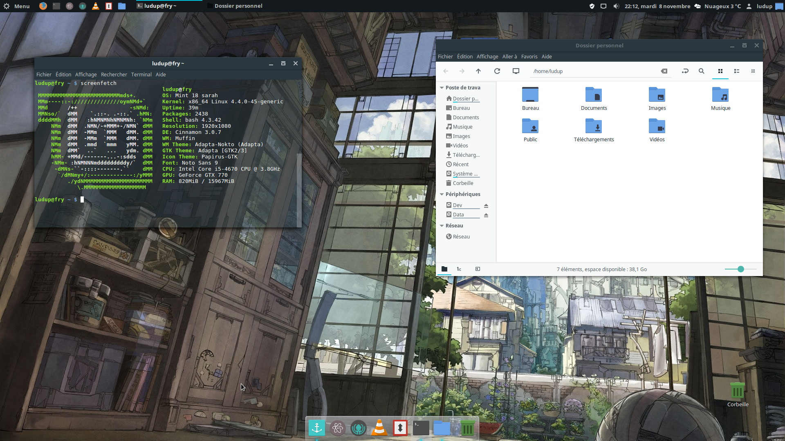

# Installation de Linux Mint 18

Ce dépôt à pour vocation de récupérer mes fichiers de configuration en cas de formatage et lister les différentes étapes de configuration.

## Check for updates

Modifier les sources logiciels -> `Fr`

> sudo apt-get update && sudo apt-get upgrade

## Install of Roboto font

## Edit Icons theme

> sudo apt-add-repository ppa:varlesh-l/papirus-pack

> sudo apt-get update

> sudo apt-get install papirus-gtk-icon-theme

## Install GTK theme

> sudo apt-add-repository ppa:tista/adapta -y

> sudo apt-get update

> sudo apt-get install adapta-gtk-theme

## Edit Wallpaper

## Install Graphics drivers

Intel + nVIDIA

## Cloud Synchronisation

Install Dropbox

## Gestionnaire de mots de passe

Installer Keeweb

## Additional softs

* [Atom](https://atom.io/)
* [F.lux](https://github.com/xflux-gui/xflux-gui)

> sudo apt-get install git python-appindicator python-xdg python-pexpect python-gconf python-gtk2 python-glade2 libxxf86vm1

> cd /tmp

> git clone "https://github.com/xflux-gui/xflux-gui.git"

> cd xflux-gui

> python download-xflux.py

> sudo python setup.py install

* NPM
* Git
* [GitKraken](https://www.gitkraken.com/)
* FileZilla
* Numlockx
* VLC
* Steam
* Docky

*All in `/var/cache/apt`*

## Reboot

Activer numlockx

## Dotfiles configuration

* Copy .config
* Copy .cinnamon
* Copy .thunderbird

## Terminal Extras

* ZSH
* Screenfetch
* Prezto
* Pure theme

## Enjoy !

